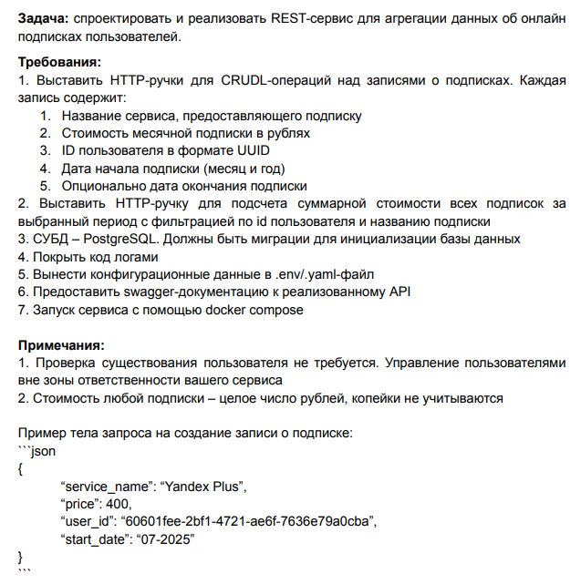

# SUBSCRIPTIONS

[](https://go.dev/)
[](https://gin-gonic.com/en/)
[](https://www.postgresql.org/)
[](https://redis.io/)
[](https://www.docker.com/)
[](https://github.com/pressly/goose)
[](https://swagger.io/)
[](https://en.wikipedia.org/wiki/REST)



# About the project

It is a simple restful api for subscriptions management that was done within test assignment. There are three-layer architecture **handlers → service → database**, server's graceful shutdown, database migrations, pagination, filtering and indexing, caching. The swagger documentation was also provided

# Main functions

- Create subscription
- Read subscription
- Update subscription
- Partial update subscription
- Delete subscription
- Get list of subscriptions
- Get total price of subscriptions

# Used in project

- Go
- Gin
- PostgreSQL
- Redis
- Goose
- Swagger
- Slog
- Docker

# Downloading and running the api

### 1. Run Docker

Install and run Docker on your computer


### 2. Build up the images

```bash
docker compose down -v
docker system prune -a -f
docker compose build --no-cache
docker compose up
```

### 2. Migrate the database using goose

Open new terminal and migrate the database

```bash
go install github.com/pressly/goose/v3/cmd/goose@latest
goose postgres "user=postgres password=password dbname=subscriptions host=localhost port=5433" up -dir ./migrations
goose postgres "user=postgres password=password dbname=subscriptions host=localhost port=5433" status -dir ./migrations
```

### 3. The api is ready

The api would be available via http://localhost:8080/subscriptions/swagger/index.html

# Project structure

```bash
subscriptions/
├── cmd/server/main.go          # Server to run
├── internal/                 
│   ├── handlers/handlers.go    # Handlers package for handling requests with gin
│   ├── service/service.go      # Service package for business logic
│   ├── database/database.go    # Database package for operating with PostgreSQL
│   ├── cache/cache.go          # Cache package for redis caching
│   ├── models/models.go        # Models package
│   └── config/config.go        # Config package
├── migrations/                 # SQL migrations
├── docs/                       # Swagger docs
├── dockerfile
├── dockerignore
├── docker-compose.yml         
├── go.mod
├── go.sum
└── .env
```
