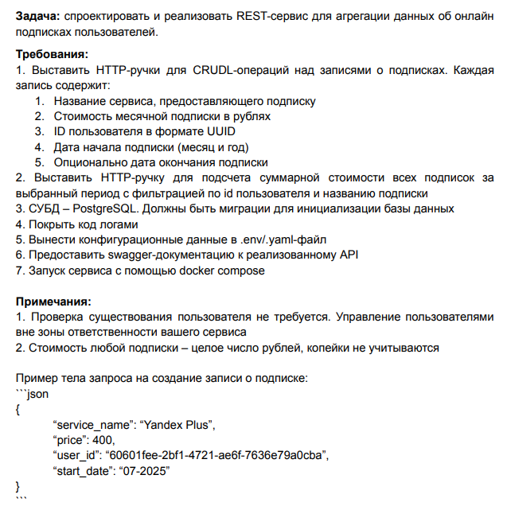

# SUBSCRIPTIONS

[](https://go.dev/)
[](https://gin-gonic.com/en/)
[](https://https://www.postgresql.org/)
[](https://www.docker.com/)
[](https://swagger.io/)
[](https://en.wikipedia.org/wiki/REST)



# About the project

Just a simple project as a part of a test assignment. You could say that this is my first meaningful mini project in Go. It was quite interesting to do because I've learned a lot of new things

# Main functions

- Create subscription
- Read subscription
- Update subscription
- Delete subscription
- Get list of subscriptions
- Get total price of subscriptions

# Used in project

- Go
- Gin
- PostgreSQL
- Swagger
- Slog
- Docker

# Downloading and running the api

### 1. Run Docker

Install and run Docker on your computer

### 2. Clone the repository

```bash
git clone https://github.com/middelmatigheid/subscriptions-api.git
cd subscriptions-api
```

### 3. Edit .env file

Create .env file in the main directory and set up the values

```bash
PORT = 8080
DB_USER = postgres
DB_PASSWORD = password 
DB_NAME = subscriptions
DB_HOST = postgres
DB_PORT = 5432
```

### 4. Build up the images

```bash
docker compose down -v
docker system prune -a -f
docker compose build --no-cache
docker compose up
```

### 5. The api is ready

The api would be available via http://localhost:8080/subscriptions/swagger/index.html

# Project structure

```bash
subscriptions/
├── cmd/server/main.go          # Api server
├── internal/                 
│   ├── database/database.go    # Database package for operating with PostgreSQL
│   ├── handlers/handlers.go    # Handlers package for handling requests
│   ├── models/models.go        # Models package
│   └── migrations/             # SQL migrations
├── docs/                       # Swagger docs
├── go.mod
├── go.sum
├── dockerfile
├── dockerignore
├── docker-compose.yml         
└── .env
```
